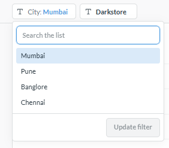
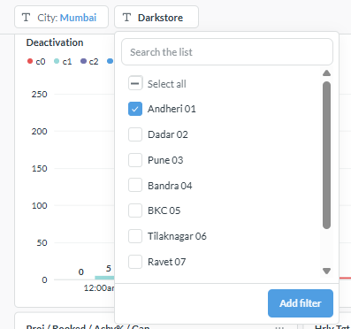

# 🚀 Real-Time Operations Analytics Dashboard

<p align="center">

<a href="https://www.postgresql.org/" target="_blank">
  
</a>

<a href="https://en.wikipedia.org/wiki/SQL" target="_blank">
  
</a>

<a href="https://www.metabase.com/" target="_blank">
  
</a>

<a href="https://www.python.org/" target="_blank">
  
</a>

<a href="https://github.com/" target="_blank">
  
</a>

</p>

---

<p align="center">
  
</p>

# ✨ Dashboard Highlights

- 📊 Real-time Operations Monitoring
- 🎯 Forecast vs Actual Tracking
- 🏙️ City-wise Performance Analysis
- 🏪 Dark Store Level Drill-down
- 📦 Product Deactivation Monitoring (C0–C3)
- 📈 Hourly Performance Tracking
- 💰 Average Order Value (AOV)
- 📦 Units Per Order (UPO)
- 📉 Delivery Gap Analysis
- ⚡ Interactive Dashboard with Dynamic Filters

---

# 🎛️ Interactive Filters

<table>
<tr>
<td align="center">
<br>
<b>City Filter</b><br>
Select a city to analyze operational KPIs and performance.
</td>

<td align="center">
<br>
<b>Dark Store Filter</b><br>
Drill down into individual dark store performance for detailed operational analysis.
</td>
</tr>
</table>

---

# 📌 Project Overview

The **Real-Time Operations Analytics Dashboard** provides live operational visibility across multiple cities and dark stores.

It enables operations teams to monitor order fulfillment, forecast achievement, product deactivation, and operational KPIs throughout the day using interactive dashboards built with **PostgreSQL**, **Advanced SQL**, and **Metabase**.

The dashboard is designed to support fast operational decision-making through real-time monitoring and drill-down capabilities.

---

# 🎯 Business Objective

The primary objective of this dashboard is to help Operations teams:

- Monitor live operational performance
- Compare Forecast vs Actual Orders
- Identify delivery gaps
- Track high-priority product deactivation
- Monitor hourly operational KPIs
- Improve operational decision making
- Analyze dark store performance

---

# 📊 Dashboard KPIs

| KPI | Description |
|------|-------------|
| Forecast | Expected orders for the day |
| Booked | Total booked orders |
| Achievement % | Forecast achievement percentage |
| Gap | Difference between Forecast and Delivered Orders |
| Hourly Target | Expected deliveries for the current hour |
| Hourly Delivered | Actual delivered orders |
| AOV | Average Order Value |
| UPO | Units Per Order |

---

# 📦 Product Deactivation Logic

The dashboard categorizes inactive products based on business priority.

| Category | Description |
|----------|-------------|
| **C0** | Top 50 ranked products currently deactivated |
| **C1** | Product ranks **51–100** currently deactivated |
| **C2** | Product ranks **101–200** currently deactivated |
| **C3** | Product ranks **201+** currently deactivated |

### Business Purpose

- C0 products require immediate operational attention.
- C1 products are high-priority products.
- C2 products represent medium-priority deactivation.
- C3 products represent lower-priority product monitoring.

The cumulative C0 trend line helps monitor the number of high-priority inactive products throughout the day.

---

# 📈 Hourly Performance Monitoring

The dashboard tracks hourly operational performance including:

- Forecast
- Booked Orders
- Hourly Delivered Orders
- Achievement %
- Delivery Gap
- Average Order Value (AOV)
- Units Per Order (UPO)
- Cumulative Forecast
- Cumulative Delivered
- Product Deactivation
- Last Week Delivered Comparison

This enables operations managers to identify bottlenecks and take corrective actions in real time.

---

# 🔍 Drill Down Flow

```text
City
   │
   ▼
Dark Store
   │
   ▼
Hourly Operations
   │
   ▼
Business KPIs
```

---

# 🛠 Technology Stack

| Technology | Purpose |
|------------|----------|
| PostgreSQL | Database |
| SQL | Business Logic |
| Metabase | Dashboard Development |
| GitHub | Version Control |

---

# 💻 SQL Highlights

The dashboard is powered by advanced PostgreSQL queries featuring:

- Common Table Expressions (CTEs)
- Window Functions
- Dynamic Filters
- Forecast Allocation Logic
- Historical Trend Analysis
- Conditional Aggregations
- Cumulative KPI Calculations
- Business Rule Based Transformations

---

# 📈 Business Impact

This dashboard enables Operations teams to:

- Monitor hourly operational performance in real time.
- Identify forecast vs actual delivery gaps.
- Track high-priority product deactivations.
- Analyze city and dark store performance.
- Improve operational efficiency.
- Support faster business decisions through interactive visualizations.

---

# 📂 Repository Structure

```text
operations-analytics-dashboard
│
├── architecture/
├── docs/
├── screenshots/
│   ├── 01-dashboard-overview.png
│   ├── 02-city-filter.png
│   └── 03-darkstore-filter.png
│
├── sql/
│
├── README.md
│
└── LICENSE
```

---

# 🚀 Future Enhancements

- Automated KPI Alerts
- Email Report Automation
- Predictive Demand Forecasting
- Mobile Dashboard
- Dark Store Benchmarking
- Operational Trend Analysis

---

# 👨‍💻 Developed By

## Vijay Sharma

**Senior Business Analyst**

**Skills**

- SQL
- PostgreSQL
- Metabase
- Python
- ETL
- Airflow
- Data Analytics
- Dashboard Development
- Business Intelligence

---

⭐ If you found this project useful, don't forget to **Star** this repository.
