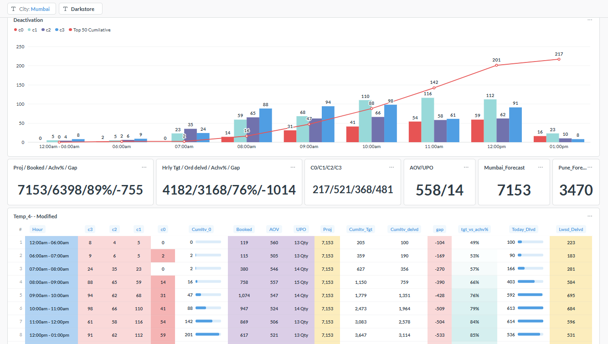

# 🚀 Real-Time Operations Analytics Dashboard



## 📌 Project Overview

The **Real-Time Operations Analytics Dashboard** is designed to provide live operational visibility across cities and dark stores. It enables operations teams to monitor order fulfillment, forecast achievement, product deactivation, and key business KPIs throughout the day.

The dashboard is built using **PostgreSQL**, **Advanced SQL**, and **Metabase**, allowing business users to analyze performance through interactive filters and drill-down capabilities.

---

# 🎯 Business Objective

The primary objective of this dashboard is to help Operations teams:

- Monitor live operational performance
- Compare Forecast vs Actual Orders
- Identify delivery gaps
- Track product deactivation trends
- Monitor dark store performance
- Improve operational decision making

---

# 📊 Dashboard Features

### 📍 Dynamic Filters

- City
- Dark Store

These filters allow users to analyze KPIs for specific operational regions and individual dark stores.

---

### 📈 Operational KPIs

The dashboard provides the following KPIs:

| KPI | Description |
|------|-------------|
| Forecast | Total projected orders for the day |
| Booked | Total booked orders |
| Achievement % | Forecast achievement percentage |
| Gap | Difference between Forecast and Delivered Orders |
| Hourly Target | Expected deliveries for the current hour |
| Hourly Delivered | Actual delivered orders |
| AOV | Average Order Value |
| UPO | Units Per Order |

---

# 📦 Product Deactivation Monitoring

The dashboard tracks inactive products based on business priority.

| Category | Description |
|----------|-------------|
| C0 | Top 50 ranked products currently deactivated |
| C1 | Product ranks 51–100 currently deactivated |
| C2 | Product ranks 101–200 currently deactivated |
| C3 | Product ranks 201+ currently deactivated |

The cumulative C0 trend helps Operations teams identify how many high-priority products remain inactive throughout the day.

---

# 📈 Hourly Performance Monitoring

The dashboard monitors hourly operational performance including:

- Forecast
- Delivered Orders
- Achievement %
- Gap Analysis
- AOV
- UPO
- Cumulative Target
- Cumulative Delivered
- Hourly Deactivation

This helps identify operational bottlenecks in real time.

---

# 🔍 Drill Down Flow

```
City
   │
   ▼
Dark Store
   │
   ▼
Hourly Performance
```

---

# 💻 SQL Highlights

The dashboard is powered by advanced PostgreSQL queries using:

- Common Table Expressions (CTEs)
- Window Functions
- Dynamic Filters
- Historical Trend Analysis
- Forecast Allocation Logic
- Cumulative KPI Calculations
- Business Rule Based Aggregations

---

# 🛠 Technology Stack

| Technology | Usage |
|------------|------|
| PostgreSQL | Database |
| SQL | Business Logic |
| Metabase | Dashboard Development |
| GitHub | Version Control |

---

# 📂 Repository Structure

```
operations-analytics-dashboard
│
├── screenshots/
├── sql/
├── docs/
├── README.md
```

---

# 🚀 Future Enhancements

- Automated alert generation
- Predictive demand forecasting
- Email KPI reports
- Mobile responsive dashboard
- Store performance benchmarking

---

# 👨‍💻 Developed By

**Vijay Sharma**

Senior Business Analyst

SQL | PostgreSQL | Metabase | ETL | Python | Data Analytics
